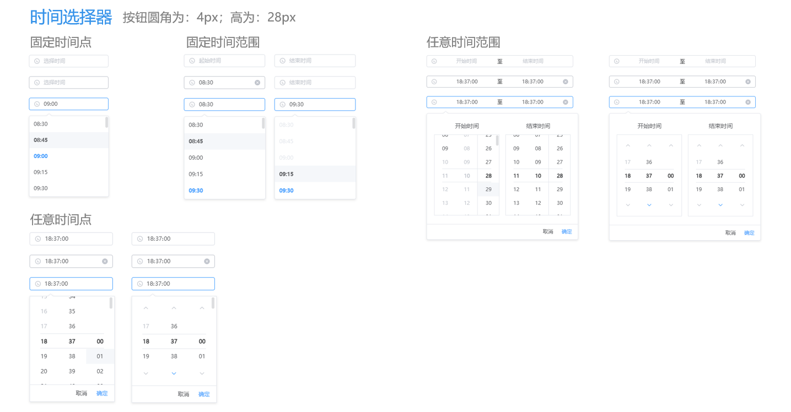

# 视觉使用规范

## 整体规范
### 1.聚焦状态
::: tip
鼠标手势需考虑不同（不同场景）

1.移入有操作的必须统一使用用cursor: point;

2.禁用状态用cursor: not-allowed;
:::

### 2.组件样式统一
::: tip
相同的组件或者页面元素用在不同页面时，必须保证样式统一（包括默认，聚焦等各种状态），避免出现样式差异
:::

### 3.弹出框
::: tip
弹出框大小，通用比例（长:高）4:3/2.5/2
:::

### 4.表格
::: tip
文案：左对齐；表格外框：1px
:::

>

### 5.查询条件区域
::: tip
字段与表单之间统一去掉：冒号
:::

>

### 6.图标+文案
::: tip
图标：主色调，文案：#606266（使用场景：表格）
:::

>

### 7.文案描述
::: tip
字段文案等描述尽量简练，描述统一，如2个字节或4个字节，避免出现描述不清，冗余，拗口等
:::

::: warning
此图片中的表格内容未左对齐，属错误案例
:::

## echarts图形色值使用规范
### 色值
>
---
|扁平色|-|-|-|-|-|-|-|
|---|---|---|---|---|---|---|---|
|#409eff|#689f4d|#f18d66|#aa5fff|#4b68fc|#0aa574|#c19a00|#9f685c|
|#6d54d9|#23ad2c|#db3232|#587b8d|#2b99a0|#4b785e|#9a873b|#e34baf|

|渐变色|-|-|-|-|-|-|-|
|---|---|---|---|---|---|---|---|
|#c4f8f1|#d9f490|#ffda68|#dac7f4|#dOe1ff|#a3f9d0|#f8ee54|#fae4e0|
|#dedcf9|#b7efbb|#ffcdcd|#d5e6ef|#b2f5f9|#90eab7|#ede2b5|#ffc2ea|

## 流程图、血缘图使用规范
### 色值
>
---
|常规状态|经过状态|选中状态(边框线)|
|---|---|---|
|#e1f3d8|#b3e09c|#67c23a|			
|#fde2e2|#fab5b5|#f56c6c|			
|#f2f3f5c|#dfe1e5|#bbbbbb|				
|#faecd8|#f2d09d|#e6a23c|			
|#d9ecff|#9fceff|#409eff|
::: tip
选中状态背景色不变，边框色值按如上变化
:::

## elementui组件视觉规范
### 色彩规范
#### 主色
>颜色是鲜艳、友好的蓝色 
<table>
<tr><td bgcolor=#409EFF colspan=9>
BrandColor  #409EFF
</td></tr>
<tr>
<td bgcolor=#53a8ff>#53a8ff</td>
<td bgcolor=#66b1ff>#66b1ff</td>
<td bgcolor=#79bbff>#79bbff</td>
<td bgcolor=#8cc5ff>#8cc5ff</td>
<td bgcolor=#a0cfff>#a0cfff</td>
<td bgcolor=#b3d8ff>#b3d8ff</td>
<td bgcolor=#c6e2ff>#c6e2ff</td>
<td bgcolor=#d9ecff>#d9ecff</td>
<td bgcolor=#ecf5ff>#ecf5ff</td>
</tr>
</table>

#### 辅助色
>除了主色外的场景色，需要在不同的场景中使用（例如危险色表示危险的操作） 
<table>
<tr>
<td bgcolor=#67C23A colspan=2>Success  #67C23A</td>
<td bgcolor=#E6A23C colspan=2>Warning  #E6A23C</td>
<td bgcolor=#F56C6C colspan=2>Danger  #F56C6C</td>
<td bgcolor=#909399 colspan=2>info  #909399</td>
</tr>
<tr>
<td bgcolor=#e1f3d8>#e1f3d8</td>
<td bgcolor=#f0f9eb>#f0f9eb</td>
<td bgcolor=#faecd8>#faecd8</td>
<td bgcolor=#fdf6ec>#fdf6ec</td>
<td bgcolor=#fde2e2>#fde2e2</td>
<td bgcolor=#fef0f0>#fef0f0</td>
<td bgcolor=#e9e9eb>#e9e9eb</td>
<td bgcolor=#f4f4f5>#f4f4f5</td>
</tr>
</table>

#### 中性色
中性色用于文本、背景和边框颜色。通过运用不同的中性色，来表现层次结构 
<table>
<tr>
<td bgcolor=#303133 colspan=2>主要文字 #303133</td>
<td bgcolor=#DCDFE6 colspan=2>一级边框 #DCDFE6</td>
<td bgcolor=#000000 colspan=2>基础黑色 #000000</td>
</tr>
<tr>
<td bgcolor=#606266 colspan=2>常规文字 #606266</td>
<td bgcolor=#E4E7ED colspan=2>二级边框 #E4E7ED</td>
<td bgcolor=#FFFFFF colspan=2>基础白色 #FFFFFF</td>
</tr>
<tr>
<td bgcolor=#909399 colspan=2>次要文字 #909399</td>
<td bgcolor=#EBEEF5 colspan=2>三级边框 #EBEEF5</td>
<td bgcolor=transparent colspan=2>透明 transparent</td>
</tr>
<tr>
<td bgcolor=#C0C4CC colspan=2>占位文字 #C0C4CC</td>
<td bgcolor=#F2F6FC colspan=2>四级边框 #F2F6FC</td>
</tr>
</table>

### 边框
#### 边框
我们提供了以下几种边框样式，以供选择
|名称|粗细|
|---|---|
|实线（solid）|1px|
|虚线（dashed）|2px|

#### 边框
我们提供了以下几种投影方式，以供选择
::: tip boxshadow
基础投影 box-shadow:0 2px 4px rgba(0, 0, 0, .12),0 0 6px rgba(0, 0, 0, .04)  
浅色投影 box-shadow: 0 2px 12px 0 rgba(0, 0, 0, 0.1)
:::

#### 圆角
我们提供了以下几种圆角方式，以供选择
::: tip boxshadow
无圆角 border-radius: 0px  
小圆角 border-radius: 2px  
大圆角 border-radius: 4px  
圆形圆角 border-radius: 30px  
:::

### 按钮
#### 基础用法
>按钮圆角为：4px；高为：28px  

### 按钮在页面使用规范
>主次按钮使用方法，按钮左对  

#### 按钮在弹窗使用规范
>主次按钮使用方法，按钮右对齐对  

### 表单
>  
---
>  
---
>
---
>
---
>
---
>
---
>
---
>
---
>
---
>
---
>
---
>
---
>
---
>
---
>
---
>

### 表格
>
---
### 树形控件/分页
>
---
### 标签
>
---
### 标记
>
---
### 警告
>
---
### 弹窗
>
---
### 通知
>
---
### 导航
>
---
>
---
>
---
### 其他
>
---
>

