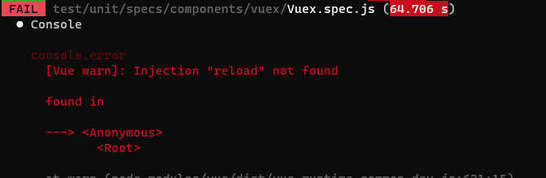

# VUE单元测试流程

> 工程构建过程参考：http://10.1.8.6:8089/web/biui-new/html/vue/helpDocs/guide/unitTest/

## 1目录结构


## 2写测试用例前需要导入公共模块和工具类

```javascript
import common from '#/common/common';
import { describe, expect } from '@jest/globals';
//common.js中封装了测试的前置操作，需要在测试用例运行前执行，持续维护
//describe是测试用例入口，expect 是断言语法
```

然后引入待测试组件，编写测试用例：

```javascript
import Hello from '@/views/Hello';
describe('HelloWorld.vue', () => {
	it('参数配置', async () => {
		await common.init();
		const msg = 'new msg';
		const wrapper = common.shallowMount(Hello, {
			propsData: { msg }
		});
		expect(wrapper.text()).toMatch(msg);
	});
});
```

 

## 3测试环境Vue组件渲染方式基于Wrapper对象

> Vue Test Utils 是一个基于包裹器的 API
>
> 一个 `Wrapper` 是一个包括了一个挂载组件或 vnode，以及测试该组件或 vnode 的方法

获取wrapper的两种方式：

- 栈渲染：shallowMount，只渲染当前组件，子组件不会渲染

- 全量渲染：mount，将组件和所有子组件一起渲染


## 4Wrapper find()方法与选择器

既可以是 **CSS 选择器**（也支持比较复杂的关系选择器组合），也可以是 **Vue 组件** 或是一个 **option 对象**，以便于在 wrapper 对象中可以轻松地指定想要查找的节点

代码示例：

```javascript
/* CSS Selector */
wrapper.find('.foo') //class syntax
wrapper.find('input') //tag syntax
wrapper.find('#foo') //id syntax
/* Vue 组件 */
const bar = wrapper.findAllComponents(Bar).at(0) //用at获取某个元素
/* option对象 */
const wrapper = wrapper.findComponent({ name: 'el-button' }) //用name查找
const wrapper = wrapper.findComponent({ ref: 'myButton' }) //用ref查找

```

> 注意：如果是查找组件要使用 findComponent，新版find方法即将废弃


 

## 5wrapper可传入option参数

1.传入组件的props

```javascript
const wrapper = shallowMount(Foo, {
	propsData: { message: 'hello' }
})
//组件名为message的props将赋值为hello
```

2.传入组件的data

```javascript
const wrapper = mount(Foo, {
	data() {
		return {
			show: true
		}
	}
})
//组件的show被赋值为true
```

3.传入store、localVue

> createLocalVue 返回一个 Vue 的类供你添加组件、混入和安装插件而不会污染全局的 Vue 类，单个组件里使用了vue-router或者Vuex的话，就要使用createLocalVue

```javascript
const wrapper = common.mount(App, {
	store: common.store,
	localVue: common.localVue,
	propsData: {
		bar: 'baz'
	}
});
```


## 6提供组件需要的mock数据

```javascript
import { vueConfig, ansibleConfig } from './commonData'
import store from '@/plugins/store/store.js';
store.commit('setVueConfig', vueConfig);
store.dispatch('ToolThemeMgt/setTheme', ansibleConfig.theme.theme);
sessionStorage.setItem('ansibleConfig', JSON.stringify(ansibleConfig.explain));
```


## 7获取到wrapper对象，触发 DOM 事件或组件行为

```javascript
const wrapper = common.mount(Login, {
   store: common.store,
   localVue: common.localVue
});
let btn = wrapper.findComponent({name: 'el-button'});
btn.trigger('click');
//触发点击事件
```

```javascript
const wrapper = common.shallowMount(Login, {
   store: common.store,
   localVue: common.localVue
});
wrapper.vm.$store.commit('setDefaultSystemId','888');
expect(wrapper.vm.$store.state.defaultSystemId).toMatch('888');
//通过vm获取vue实例调用方法
```

 

## 8通过jest断言判断结果

```javascript
expect(sum(1, 1)).toBe(2)
//expect(...)返回一个“期望”对象，.toBe(..) 是匹配器。匹配器将 expect() 的结果（实际值）与自己的参数（期望值）进行比较
```

常用的匹配器：

> toBe 使用 Object.is 判断是否严格相等
>
> toEqual 递归检查对象或数组的每个字段
>
> toBeNull 只匹配 null
>
> toBeUndefined 只匹配 undefined
>
> toBeDefined 只匹配非 undefined
>
> toBeTruthy 只匹配真
>
> toBeFalsy 只匹配假
>
> toBeGreaterThan 实际值大于期望
>
> toBeGreaterThanOrEqual 实际值大于或等于期望值 
>
> toBeLessThan 实际值小于期望值
>
> toBeLessThanOrEqual 实际值小于或等于期望值
>
> toBeCloseTo 比较浮点数的值，避免误差
>
> toMatch 正则匹配
>
> toContain 判断数组中是否包含指定项
>
> toHaveProperty(keyPath, value) 判断对象中是否包含指定属性
>
> toThrow 判断是否抛出指定的异常
>
> toBeInstanceOf 判断对象是否是某个类的实例，底层使用 instanceof

完整示例：


运行结果：


test/unit目录下生成coverage目录，存放单元测试报告：


默认npm run test会执行全部spec.js文件，如果需要指定测试文件，可以修改package.json中jest配置项：

```javascript
"testMatch": [
	"<rootDir>/test/unit/**/*.spec.js"
]
//把星号改为具体文件名即可
```


## 9vuex测试

```javascript
describe('mutations', () => {
	it('upMenuName', async () => {
		await common.init();
		const wrapper = common.shallowMount(Login, {
			store: common.store,
			localVue: common.localVue
		});
		wrapper.vm.setDefaultSystemId('888');
		expect(wrapper.vm.$store.state.defaultSystemId).toMatch('888');
	});
});
```

 

## 10测试异步代码

```javascript
describe('Login.vue', () => {
	it('检查弹出验证码', async (done) => {
		await common.init();
		const wrapper = common.mount(Login, {
			store: common.store,
			localVue: common.localVue	
		});
		let btn = wrapper.findComponent({name: 'el-button'});
		wrapper.vm.name = '9990035';
		wrapper.vm.password = 'newland123';
		await btn.trigger('click');
		setTimeout(() => {
			expect(wrapper.vm.slideShow).toBe(true);
			done();
		}, 500);
	});
})
//done,await,setitmeout
```


## 11注意事项

1.不要引入main.js

```javascript
new Vue({
	router,
	store,
	render: h => h(App)
}).$mount('#app')  //会报错
```

2.测试代码会进行语法校验，错误需要修改

```javascript
import { router } from "../../../main";
//引用的模块代码不能包含main.js
```

```javascript
import Snap from "imports-loader?this=>window,fix=>module.exports=0!snapsvg/dist/snap.svg.js";
//jest环境不支持,修改为
import Snap from 'snapsvg'
//在vue.config中增加配置
module: {
	rules: [
		{
			test: require.resolve('snapsvg/dist/snap.svg.js'),
			use: 'imports-loader?this=>window,fix=>module.exports=0'
		},
	],
},
resolve: {
	alias: { // 配置快捷路径
		'@views': '@/views',
		'@component': '@/components',
		'snapsvg': 'snapsvg/dist/snap.svg.js'
	}
}
```

```javascript
//自助报表finance自定义函数报错
var scope = this.DayCount = {}; 
//修改为
var scope = {};
```

```javascript
import localforage from 'localforage'
import bdComptsPc from 'bd-compts-pc'
import bdComptsHd from 'bd-compts-hd'
// 运行过程中缺少依赖,需要在createLocalVue的时候导入依赖
```


```javascript
//jsdom环境没有link标签 
if(document.querySelector('link[rel="icon"]')){
   document.querySelector('link[rel="icon"]').setAttribute('href', ansible.data.explain.favIcon || 'favicon.ico');
}
```

缺少inject导致报错：

```javascript
const wrapper = common.shallowMount(Index, {
	store: common.store,
	localVue: common.localVue,
	provide() {		//需要手动传入provide
		return {
			reload: ()=>{}
		}
	}
});
```



缺少原型属性，需要重新绑定：

```javascript
import Watermark from '@/plugins/store/module/watermark'
localVue.prototype.$Watermark = Watermark
```


路径没有配置标识符导致文件找不到：

```javascript
'@views': '@/views',
'@component': '@/components'
//vue.config中配置了两个特殊的标识符，jest环境也要对应配置
"moduleNameMapper": {
   "@views/(.*)$": "<rootDir>/src/views/$1",
   "@component/(.*)$": "<rootDir>/src/components/$1"
}
```

